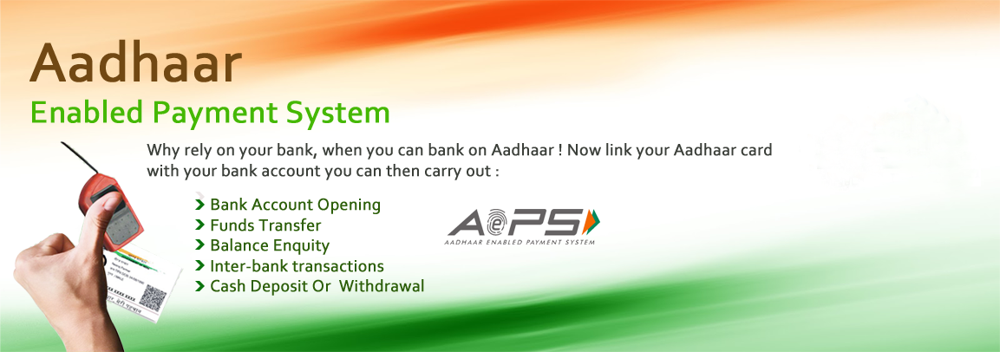

# nb2bpay.github.io
Welcome to NB2B/Pay
<!DOCTYPE html>
<!-- saved from url=(0030)https://www.moneypay.com/ -->
<html oncontextmenu="return false" xmlns="http://www.w3.org/1999/xhtml" class="fontawesome-i2svg-active fontawesome-i2svg-complete"><head><meta http-equiv="Content-Type" content="text/html; charset=UTF-8">
<!--Start of Tawk.to Script-->

<!--End of Tawk.to Script-->

    <meta name="viewport" content="width=device-width, initial-scale=1.0"><meta http-equiv="X-UA-Compatible" content="IE=edge"><title>Welcome To Money/pay /</title><link rel="stylesheet" href="./animationbackground.css"><link rel="stylesheet" href="./crakers.css"><link rel="shortcut icon" href="https://www.igitalpay.com/images/shortcuticon.png">
    <!-- Bootstrap CSS CDN -->
    <link rel="stylesheet" href="./bootstrap.min.css">
    <!-- Our Custom CSS -->
    <link rel="stylesheet" href="./style2.css"><link rel="stylesheet" href="./news.css">
    <!-- Scrollbar Custom CSS -->
    <link rel="stylesheet" href="./jquery.mCustomScrollbar.min.css"><link rel="stylesheet" href="./font-awesome.min.css">
    
    
    
    <!-- Font Awesome JS -->
    <link rel="stylesheet" href="./popup.css">

    
    
    
    
</head>
<body class="" style="">
    <form method="post" action="https://www.moneypay.com/" id="form1">

<input type="hidden" name="__VIEWSTATE" id="__VIEWSTATE" value="AGthmyqb5+Q0z5jg+l319VN9DtErMNFdfBocMN3zzd85jQ2gD9BOXssFZkpe1ok6dgydaukMs5QcoTPEG4gqju3O98dHhbWM2WevZSysxCVdHuvj0Rlk5mCi3hYKPaGr0VrdrrKk3uDAhM4aJI0et9oBLWKzWnjqNQdG8+ElLCT9GIUd3dl+AACCN5cUXH9I6a2RjdW0WsFawvLkK5vcIi8mLrfLb9q6/JXhbIhAB7auJ7NQe2O0st0dm4z2Ktb/pQ3OL3XSW/K5JaDeNeepWFgPiSaokG4utdG6+YJEe4Db7qD4tKwKdjZI3BdJ6Qebql2Iyr8Qpf7xnqtmrnBue0zS60AOCuEV1pjRrj6krvYKZ7AOechjpuFCsAd8+i1RcVHbHFZqjhzrMuzxj1QSQaTdcVWjTv4MNV6S9eBDf23RCEWE">

	<input type="hidden" name="__VIEWSTATEGENERATOR" id="__VIEWSTATEGENERATOR" value="90059987">

        
		
		
        

            

                

                    

                        

                            <button type="button" class="close" data-dismiss="modal" aria-hidden="true">×</button>
                        

                        

						
						<canvas id="canvas" width="1366" height="568"></canvas>
                            

                                

                                    

                                 
                                

                                    <h2>
                                        </h2>
                                

                                

                                    
                                

                            

                        

                    

                

            

        

        
        

            <!-- Sidebar  -->
            <nav id="sidebar" class="mCustomScrollbar _mCS_1 mCS-autoHide mCS_no_scrollbar" style="overflow: visible;">

                

                    <h3>
                        
                    </h3>
                

                <ul class="list-unstyled components">
                    <li class="active">
                        <a href="https://www.moneypay.com/index.aspx"><svg class="svg-inline--fa fa-home fa-w-18" aria-hidden="true" data-prefix="fa" data-icon="home" role="img" xmlns="http://www.w3.org/2000/svg" viewBox="0 0 576 512" data-fa-i2svg=""><path fill="currentColor" d="M488 312.7V456c0 13.3-10.7 24-24 24H348c-6.6 0-12-5.4-12-12V356c0-6.6-5.4-12-12-12h-72c-6.6 0-12 5.4-12 12v112c0 6.6-5.4 12-12 12H112c-13.3 0-24-10.7-24-24V312.7c0-3.6 1.6-7 4.4-9.3l188-154.8c4.4-3.6 10.8-3.6 15.3 0l188 154.8c2.7 2.3 4.3 5.7 4.3 9.3zm83.6-60.9L488 182.9V44.4c0-6.6-5.4-12-12-12h-56c-6.6 0-12 5.4-12 12V117l-89.5-73.7c-17.7-14.6-43.3-14.6-61 0L4.4 251.8c-5.1 4.2-5.8 11.8-1.6 16.9l25.5 31c4.2 5.1 11.8 5.8 16.9 1.6l235.2-193.7c4.4-3.6 10.8-3.6 15.3 0l235.2 193.7c5.1 4.2 12.7 3.5 16.9-1.6l25.5-31c4.2-5.2 3.4-12.7-1.7-16.9z"></path></svg><!-- <i class="fa fa-home" aria-hidden="true"></i> -->
                            Home </a>
                    </li>
                    <li>
                        <a href="https://moneypay.com/aboutus.html"><svg class="svg-inline--fa fa-user fa-w-14" aria-hidden="true" data-prefix="fa" data-icon="user" role="img" xmlns="http://www.w3.org/2000/svg" viewBox="0 0 448 512" data-fa-i2svg=""><path fill="currentColor" d="M224 256c70.7 0 128-57.3 128-128S294.7 0 224 0 96 57.3 96 128s57.3 128 128 128zm89.6 32h-16.7c-22.2 10.2-46.9 16-72.9 16s-50.6-5.8-72.9-16h-16.7C60.2 288 0 348.2 0 422.4V464c0 26.5 21.5 48 48 48h352c26.5 0 48-21.5 48-48v-41.6c0-74.2-60.2-134.4-134.4-134.4z"></path></svg><!-- <i class="fa fa-user" aria-hidden="true"></i> -->
                            About Us </a>
                    </li>
                    <li>
                        <a href="https://www.moneypay.com/#homeSubmenu" data-toggle="collapse" aria-expanded="false" class="dropdown-toggle"><svg class="svg-inline--fa fa-list fa-w-16" aria-hidden="true" data-prefix="fa" data-icon="list" role="img" xmlns="http://www.w3.org/2000/svg" viewBox="0 0 512 512" data-fa-i2svg=""><path fill="currentColor" d="M128 116V76c0-8.837 7.163-16 16-16h352c8.837 0 16 7.163 16 16v40c0 8.837-7.163 16-16 16H144c-8.837 0-16-7.163-16-16zm16 176h352c8.837 0 16-7.163 16-16v-40c0-8.837-7.163-16-16-16H144c-8.837 0-16 7.163-16 16v40c0 8.837 7.163 16 16 16zm0 160h352c8.837 0 16-7.163 16-16v-40c0-8.837-7.163-16-16-16H144c-8.837 0-16 7.163-16 16v40c0 8.837 7.163 16 16 16zM16 144h64c8.837 0 16-7.163 16-16V64c0-8.837-7.163-16-16-16H16C7.163 48 0 55.163 0 64v64c0 8.837 7.163 16 16 16zm0 160h64c8.837 0 16-7.163 16-16v-64c0-8.837-7.163-16-16-16H16c-8.837 0-16 7.163-16 16v64c0 8.837 7.163 16 16 16zm0 160h64c8.837 0 16-7.163 16-16v-64c0-8.837-7.163-16-16-16H16c-8.837 0-16 7.163-16 16v64c0 8.837 7.163 16 16 16z"></path></svg><!-- <i class="fa fa-list" aria-hidden="true"></i> -->
                            Our Services </a>
                        <ul class="collapse list-unstyled" id="homeSubmenu">
                            <li>
                                <a href="https://www.moneypay.com/recharge.html">Recharge </a>
                            </li>
                            <li>
                                <a href="https://www.moneypay.com/moneytransfer.html">Money Transfer </a>
                            </li>
                            <li>
                                <a href="https://www.moneypay.com/aeps.html">AEPS </a>
                            </li>
                            <li>
                                <a href="https://www.moneypay.com/bbps.html">BBPS </a>
                            </li>
                            <li>
                                <a href="https://www.moneypay.com/creditcardbillpay.html">Credit Card Bill Payment  </a>
                            </li>
                            <li>
                                <a href="https://www.moneypay.com/insurancebillpay.html">Insurance Bill Payment  </a>
                            </li>
                            <li>
                                <a href="https://www.moneypay.com/pancard.html">Pan Card  </a>
                            </li>
                            <li>
                                <a href="https://www.moneypay.com/indonepalmonetytransfer.html">Indo Nepal Money Transfer  </a>
                            </li>
                            <li>
                                <a href="https://www.moneypay.com/hathwaycabletvrecharge.html">Hathway Cable Tv Recharge  </a>
                            </li>
                            <li>
                                <a href="https://www.moneypay.com/loan.html">Loan   </a>
                            </li>
                            <li>
                                <a href="https://www.moneypay.com/accountopening.html">Account Opening   </a>
                            </li>
                            <li>
                                <a href="https://www.moneypay.com/adhardownloadbybiomatric.html">Aadhaar Download by Biomatric  </a>
                            </li>
                            <li>
                                <a href="https://www.moneypay.com/hotelticketbooking.html">Hotel Ticket Booking  </a>
                            </li>
                            <li>
                                <a href="https://www.moneypay.com/busticketbooking.html">Bus Ticket Booking  </a>
                            </li>
                            <li>
                                <a href="https://www.moneypay.com/flightticketbooking.html">Flight Ticket Booking  </a>
                            </li>
                            <li>
                                <a href="https://www.moneypay.com/insuranceenrollment.html">Insurance Enrollment  </a>
                            </li>
                        </ul>
                    </li>
                    <li>
                        <a href="https://www.moneypay.com/api.html"><svg class="svg-inline--fa fa-check-square fa-w-14" aria-hidden="true" data-prefix="fa" data-icon="check-square" role="img" xmlns="http://www.w3.org/2000/svg" viewBox="0 0 448 512" data-fa-i2svg=""><path fill="currentColor" d="M400 480H48c-26.51 0-48-21.49-48-48V80c0-26.51 21.49-48 48-48h352c26.51 0 48 21.49 48 48v352c0 26.51-21.49 48-48 48zm-204.686-98.059l184-184c6.248-6.248 6.248-16.379 0-22.627l-22.627-22.627c-6.248-6.248-16.379-6.249-22.628 0L184 302.745l-70.059-70.059c-6.248-6.248-16.379-6.248-22.628 0l-22.627 22.627c-6.248 6.248-6.248 16.379 0 22.627l104 104c6.249 6.25 16.379 6.25 22.628.001z"></path></svg><!-- <i class="fa fa-check-square"aria-hidden="true"></i>--API </a>
                        </li><li>
                            <a href="https://moneypay.com/termsandconditions.html"><svg class="svg-inline--fa fa-book fa-w-14" aria-hidden="true" data-prefix="fa" data-icon="book" role="img" xmlns="http://www.w3.org/2000/svg" viewBox="0 0 448 512" data-fa-i2svg=""><path fill="currentColor" d="M448 360V24c0-13.3-10.7-24-24-24H96C43 0 0 43 0 96v320c0 53 43 96 96 96h328c13.3 0 24-10.7 24-24v-16c0-7.5-3.5-14.3-8.9-18.7-4.2-15.4-4.2-59.3 0-74.7 5.4-4.3 8.9-11.1 8.9-18.6zM128 134c0-3.3 2.7-6 6-6h212c3.3 0 6 2.7 6 6v20c0 3.3-2.7 6-6 6H134c-3.3 0-6-2.7-6-6v-20zm0 64c0-3.3 2.7-6 6-6h212c3.3 0 6 2.7 6 6v20c0 3.3-2.7 6-6 6H134c-3.3 0-6-2.7-6-6v-20zm253.4 250H96c-17.7 0-32-14.3-32-32 0-17.6 14.4-32 32-32h285.4c-1.9 17.1-1.9 46.9 0 64z"></path></svg><!-- <i class="fa fa-book" aria-hidden="true"></i> -->Terms &amp; Conditions </a>
                        </li>
					<li>
                            <a href="https://moneypay.com/privacy-policy.html"><svg class="svg-inline--fa fa-book fa-w-14" aria-hidden="true" data-prefix="fa" data-icon="book" role="img" xmlns="http://www.w3.org/2000/svg" viewBox="0 0 448 512" data-fa-i2svg=""><path fill="currentColor" d="M448 360V24c0-13.3-10.7-24-24-24H96C43 0 0 43 0 96v320c0 53 43 96 96 96h328c13.3 0 24-10.7 24-24v-16c0-7.5-3.5-14.3-8.9-18.7-4.2-15.4-4.2-59.3 0-74.7 5.4-4.3 8.9-11.1 8.9-18.6zM128 134c0-3.3 2.7-6 6-6h212c3.3 0 6 2.7 6 6v20c0 3.3-2.7 6-6 6H134c-3.3 0-6-2.7-6-6v-20zm0 64c0-3.3 2.7-6 6-6h212c3.3 0 6 2.7 6 6v20c0 3.3-2.7 6-6 6H134c-3.3 0-6-2.7-6-6v-20zm253.4 250H96c-17.7 0-32-14.3-32-32 0-17.6 14.4-32 32-32h285.4c-1.9 17.1-1.9 46.9 0 64z"></path></svg><!-- <i class="fa fa-book"aria-hidden="true"></i> -->Privacy Policy </a>
                        </li>
                        <li>
                            <a href="https://moneypay.com/contactus.html"><svg class="svg-inline--fa fa-envelope fa-w-16" aria-hidden="true" data-prefix="fa" data-icon="envelope" role="img" xmlns="http://www.w3.org/2000/svg" viewBox="0 0 512 512" data-fa-i2svg=""><path fill="currentColor" d="M502.3 190.8c3.9-3.1 9.7-.2 9.7 4.7V400c0 26.5-21.5 48-48 48H48c-26.5 0-48-21.5-48-48V195.6c0-5 5.7-7.8 9.7-4.7 22.4 17.4 52.1 39.5 154.1 113.6 21.1 15.4 56.7 47.8 92.2 47.6 35.7.3 72-32.8 92.3-47.6 102-74.1 131.6-96.3 154-113.7zM256 320c23.2.4 56.6-29.2 73.4-41.4 132.7-96.3 142.8-104.7 173.4-128.7 5.8-4.5 9.2-11.5 9.2-18.9v-19c0-26.5-21.5-48-48-48H48C21.5 64 0 85.5 0 112v19c0 7.4 3.4 14.3 9.2 18.9 30.6 23.9 40.7 32.4 173.4 128.7 16.8 12.2 50.2 41.8 73.4 41.4z"></path></svg><!-- <i class="fa fa-envelope" aria-hidden="true"></i> -->Contact Us </a>
                        </li>
                    
                </ul>
            

</nav>
            <!-- Page Content  -->
            

                <nav class="navbar navbar-expand-lg navbar-light bg-light">
                    

                        <button type="button" id="sidebarCollapse" class="btn btn-info">
                            <svg class="svg-inline--fa fa-align-left fa-w-14" aria-hidden="true" data-prefix="fas" data-icon="align-left" role="img" xmlns="http://www.w3.org/2000/svg" viewBox="0 0 448 512" data-fa-i2svg=""><path fill="currentColor" d="M288 44v40c0 8.837-7.163 16-16 16H16c-8.837 0-16-7.163-16-16V44c0-8.837 7.163-16 16-16h256c8.837 0 16 7.163 16 16zM0 172v40c0 8.837 7.163 16 16 16h416c8.837 0 16-7.163 16-16v-40c0-8.837-7.163-16-16-16H16c-8.837 0-16 7.163-16 16zm16 312h416c8.837 0 16-7.163 16-16v-40c0-8.837-7.163-16-16-16H16c-8.837 0-16 7.163-16 16v40c0 8.837 7.163 16 16 16zm256-200H16c-8.837 0-16 7.163-16 16v40c0 8.837 7.163 16 16 16h256c8.837 0 16-7.163 16-16v-40c0-8.837-7.163-16-16-16z"></path></svg><!-- <i class="fas fa-align-left"></i> -->
                            
                        </button>
						
                        

                            <ul class="nav navbar-nav ml-auto">
								
							<li class="demo-click-new"></li>
                                <li style="font-size: 12px; padding-right: 20px; padding-top: 5px; color: #0b0ba1; list-style:none;">Customer Care : 6201989869
                                </li>
                                <li style="font-size: 12px; padding-right: 20px; padding-top: 5px; color: #0b0ba1;list-style:none;">E-mail Id : nb2bpay@gmail.com
                                </li>
							<li style="margin-right: 15px;">
                                    <a href="https://moneypay.com" class="btn btn-primary btn-sm">ICICI Kiosk Login </a>
                                </li>
								 
                                <li style="margin-right: 15px;">
                                    <a href="file:///C:/Users/Rishabh%20Jaiswal/Documents/New%20folder/New%20folder%20(2)/New%20folder/memberlogin.html" target="_blank" class="btn btn-primary btn-sm">ICICI Bank Login </a>
                                </li>
                                <li style="margin-right: 15px; ">
                                    <a href="file:///C:/Users/DELL/Documents/New%20folder/New%20folder%20(2)/New%20folder/memberlogin.html" target="_blank" class="btn btn-primary btn-sm">Money/Pay Login </a>
                                </li>
                                <li>
                                    <a href="file:///C:/Users/Rishabh%20Jaiswal/Documents/New%20folder/New%20folder%20(2)/registration%20form%20.html" class="btn btn-primary btn-sm">Register </a>
                                </li>
                            </ul>
                        

                    

                </nav>
                <nav class="navbar navbar-expand-lg navbar-light bg-light" style="padding: 0 10px 0 0;">
                    Latest Updates :   
                    &nbsp; &nbsp;  
                        <marquee behavior="scroll" scrollamount="3" onmouseover="this.stop()" onmouseout="this.start()"> Welcome to Money/pay  </marquee>
                    
                </nav>
                

                    

                        

                            

                                    
                                

                                 

                                    
                                

                                

                                    
                                

                                  

                                    
                                

                                

                                    
                                

                                

                                    
                                

                                

                                    
                                

                                

                                    
                                

                            

                                    
                                

                            <a class="carousel-control-prev" href="" role="button" data-slide="prev">
                                
                                Previous
                            </a>
                            <a class="carousel-control-next" href="" role="button" data-slide="next">
                                
                                Next
                            </a>
                        

                    

                

                

                    

                        <h1 style="font-size: 25px; padding-top: 15px; color: #0b3a6f;">Welcome To Money/Pay  </h1>
                        

                            Money/Pay Digital Technology is a web portal designed to provide various services in order to cater to the needs 
                            of digital customer in a productive way.These services include Money Transfer, AEPS (Aadhaar Enable 
                            Payment System), Recharge, BBPS, Credit Card Bill Payment, Insurance Bill Payment, and Pan Card. 
                            These are the services that we require in our day to day lives so to make the execution easier we 
                            have come up with this website. It is a one-stop solution to all your digital technology needs.
                            All the transactions made on our website are secure thereby keeping thepersonal data of customers safe from any kind of breach.
                        

                        
<a href="https://moneypay/aboutus.html" class="btn btn-primary">Read More </a>

                    

                

                

                    

                        <h1 style="font-size: 25px; padding-top: 15px; color: #0b3a6f;">Our Services  </h1>
                        

                    

                

                

                    

                        

                            <i>
                                
                            </i>
                            <h3>All Recharge  </h3>
                            

                            
Today Mobile phones have become an integral part of our lives and recharging it has become an everyday need for many. Through our website, you get the    

                            
<a href="https://moneypay.com/recharge.html">Read More</a>

                        

                    

                    

                        

                            <i>
                                
                            </i>
                            <h3>Money Transfer  </h3>
                            

                            
Need to transfer money to a colleague, friends, family or someone else? Need it to be easy, breezy, and fun? This is the platform for you. Money transferring     

                            
<a href="https://www.moneypay.com/moneytransfer.html">Read More</a>

                        

                    

                    

                        

                            <i>
                                
                            </i>
                            <h3>AEPS  </h3>
                            

                            
Aadhaar Enabled Payment System is a significant stepping stone in making India digital. This system basically allows the clients to provide Aadhaar as the     

                            
<a href="https://www.moneypay.com/aeps.html">Read More</a>

                        

                    

                    

                        

                            <i>
                                
                            </i>
                            <h3>BBPS   </h3>
                            

                            
Long gone are the days when you had to go to 8 different places to fill the 7 different bills that came to your house. Be it electricity, broadband,     

                            
<a href="https://www.moneypay.com/bbps.html">Read More</a>

                        

                    

                

                

                    

                        

                            <i>
                                
                            </i>
                            <h3>Credit Card Bill Payment   </h3>
                            

                            
Credit cards have become the life force of many people. And why not? They make buying expensive things easier and more convenient.      

                            
<a href="https://www.moneypay.com/creditcardbillpay.html">Read More</a>

                        

                    

                    

                        

                            <i>
                                
                            </i>
                            <h3>Insurance Bill Payment  </h3>
                            

                            
Insurances are one way of making you feel a bit more secure in life. Insurances like death insurance, health insurance or others give you control over your      

                            
<a href="https://www.moneypay.com/insurancebillpay.html">Read More</a>

                        

                    

                    

                        

                            <i>
                                
                            </i>
                            <h3>Pan Card   </h3>
                            

                            
Pan Card is essential for a working and non-working person. PAN stands for Permanent Account Number. It is a way of tracking the income of the people     

                            
<a href="https://www.moneypay.com/pancard.html">Read More</a>

                        

                    

                    

                        

                            <i>
                                
                            </i>
                            <h3>Indo Nepal Money Transfer   </h3>
                            

                            
Nepal and India are two separate countries and it was compulsory for oneto visit thebranch of any bank to transfer money from India to Nepal. As earlier, it     

                            
<a href="https://www.moneypay.com/indonepalmonetytransfer.html">Read More</a>

                        

                    

                

                

                    

                        

                            <i>
                                
                            </i>
                            <h3>Hathway Cable Tv Recharge  </h3>
                            

                            
In today's time,Cable Television can be found in every home. To continue enjoying the cable tv services it is important for the user to pay monthly bills. There are many      

                            
<a href="https://www.moneypay.com/hathwaycabletvrecharge.html">Read More</a>

                        

                    

                    

                        

                            <i>
                                
                            </i>
                            <h3>Loan   </h3>
                            

                            
Loans are one of the best and fastest ways of raising instant money. Whether you are starting a new business, buying a house or car, you can get a loan for that. There are many companies out there who     

                            
<a href="https://www.moneypay.com/loan.html">Read More</a>

                        

                    

                    

                        

                            <i>
                                
                            </i>
                            <h3>Account Opening   </h3>
                            

                            
We have launched a service that enables our users to open an account online at any bank without any difficulty. All you need to do is fill out the online application form to have the best banking     

                            
<a href="https://www.moneypay.com/accountopening.html">Read More</a>

                        

                    

                    

                        

                            <i>
                                
                            </i>
                            <h3>Aadhaar Download by Biomatric   </h3>
                            

                            
Indian citizens need an Aadhaar Card to use government welfare facilities. This very document contains the basic information of an individual, including his    

                            
<a href="https://www.moneypay.com/adhardownloadbybiomatric.html">Read More</a>

                        

                    

                

                <footer class="footer" style="margin-top: 20px;">
                    

                        

                            

                                <h5 class="headin5_amrc col_white_amrc pt2">Main Menus </h5>
                                <!--headin5_amrc-->
                                <ul class="footer_ul_amrc">
                                    <li><a href="https://www.moneypay.com/index.aspx">Home </a></li>
                                    <li><a href="https://moneypay.com/aboutus.html">About Us </a></li>
                                    <li><a href="https://moneypay.com/termsandconditions.html">Terms &amp; Conditions </a></li>
                                    <li><a href="https://moneypay.com/contactus.html">Contact Us</a></li>
                                </ul>
                                <h5 class="headin5_amrc col_white_amrc pt2">Our Services </h5>
                                <ul class="footer_ul_amrc">
                                    <li><a href="https://www.moneypay.com/recharge.html">All Recharge  </a></li>
                                    <li><a href="https://www.moneypay.com/moneytransfer.html">Money Transfer  </a></li>
                                    <li><a href="https://www.moneypay.com/aeps.html">AEPS </a></li>
                                    <li><a href="https://www.moneypay.com/adhardownloadbybiomatric.html">Aadhaar Download by Biomatric </a></li>
                                </ul>
                                <!--footer_ul_amrc ends here-->
                            

                            

                                <h5 class="headin5_amrc col_white_amrc pt2">Our Services </h5>
                                <!--headin5_amrc-->
                                <ul class="footer_ul_amrc">
                                    <li><a href="https://www.moneypay.com/creditcardbillpay.html">Credit Card Bill Payment </a></li>
                                    <li><a href="https://www.moneypay.com/insurancebillpay.html">Insurance Bill Payment  </a></li>
                                    <li><a href="https://www.moneypay.com/pancard.html">Pan Card   </a></li>

                                    <li><a href="https://www.moneypay.com/indonepalmonetytransfer.html">Indo Nepal Money Transfer   </a></li>
                                    <li><a href="https://www.moneypay.com/hathwaycabletvrecharge.html">Hathway Cable Tv Recharge   </a></li>
                                    <li><a href="https://www.moneypay.com/loan.html">Loan   </a></li>
                                    <li><a href="https://www.moneypay.com/accountopening.html">Account Opening    </a></li>
                                    <li><a href="https://www.moneypay.com/bbps.html">BBPS  </a></li>
                                </ul>
                                <!--footer_ul_amrc ends here-->
                            

                            

                                <h5 class="headin5_amrc col_white_amrc pt2">Find us </h5>
                                <!--headin5_amrc-->
                                

                                    <svg class="svg-inline--fa fa-location-arrow fa-w-16" aria-hidden="true" data-prefix="fa" data-icon="location-arrow" role="img" xmlns="http://www.w3.org/2000/svg" viewBox="0 0 512 512" data-fa-i2svg=""><path fill="currentColor" d="M443.683 4.529L27.818 196.418C-18.702 217.889-3.39 288 47.933 288H224v175.993c0 51.727 70.161 66.526 91.582 20.115L507.38 68.225c18.905-40.961-23.752-82.133-63.697-63.696z"></path></svg><!-- <i class="fa fa-location-arrow"></i. -->  Money/Pay Digital Technology
                                     
                                    Corporate Office: Rajkumar Parsad Apartment,
                                     
                                    Near Chaudhary Petrol Pump,
                                     
                                    Patna , Bihar , India-800020
                                

                                
<svg class="svg-inline--fa fa-phone fa-w-16" aria-hidden="true" data-prefix="fa" data-icon="phone" role="img" xmlns="http://www.w3.org/2000/svg" viewBox="0 0 512 512" data-fa-i2svg=""><path fill="currentColor" d="M493.4 24.6l-104-24c-11.3-2.6-22.9 3.3-27.5 13.9l-48 112c-4.2 9.8-1.4 21.3 6.9 28l60.6 49.6c-36 76.7-98.9 140.5-177.2 177.2l-49.6-60.6c-6.8-8.3-18.2-11.1-28-6.9l-112 48C3.9 366.5-2 378.1.6 389.4l24 104C27.1 504.2 36.7 512 48 512c256.1 0 464-207.5 464-464 0-11.2-7.7-20.9-18.6-23.4z"></path></svg><!-- <i class="fa fa-phone"></i> -->  6201989869 , 6200985903 , 9708157139  

                                
<svg class="svg-inline--fa fa-envelope fa-w-16" aria-hidden="true" data-prefix="fa" data-icon="envelope" role="img" xmlns="http://www.w3.org/2000/svg" viewBox="0 0 512 512" data-fa-i2svg=""><path fill="currentColor" d="M502.3 190.8c3.9-3.1 9.7-.2 9.7 4.7V400c0 26.5-21.5 48-48 48H48c-26.5 0-48-21.5-48-48V195.6c0-5 5.7-7.8 9.7-4.7 22.4 17.4 52.1 39.5 154.1 113.6 21.1 15.4 56.7 47.8 92.2 47.6 35.7.3 72-32.8 92.3-47.6 102-74.1 131.6-96.3 154-113.7zM256 320c23.2.4 56.6-29.2 73.4-41.4 132.7-96.3 142.8-104.7 173.4-128.7 5.8-4.5 9.2-11.5 9.2-18.9v-19c0-26.5-21.5-48-48-48H48C21.5 64 0 85.5 0 112v19c0 7.4 3.4 14.3 9.2 18.9 30.6 23.9 40.7 32.4 173.4 128.7 16.8 12.2 50.2 41.8 73.4 41.4z"></path></svg><!-- <i class="fa fa fa-envelope"></i> -->  moneypay@gmail.com , Support@moneypay.com  

                            

                            

                                <h5 class="headin5_amrc col_white_amrc pt2">Social Links </h5>
                                <!--headin5_amrc-->
                                <ul class="footer_ul_amrc">
                                    <li><a href=""><i class="" style="background-color: #0a52ce; padding: 4px 1px 5px 8px; border-radius: 57%;">
                                        
                                    </i>&nbsp; Facebook  </a></li>
                                    <li><a href=""><i class=" " style="background-color: #0a52ce; padding: 4px 1px 5px 8px; border-radius: 57%;">
                                        
                                    </i>&nbsp;  Twitter  </a></li>
                                    <li><a href=""><i class=" " style="background-color: #0a52ce; padding: 4px 1px 5px 8px; border-radius: 57%;">
                                        
                                    </i>&nbsp; Google Plus </a></li>
                                    <li><a href=""><i class=" " style="background-color: #0a52ce; padding: 4px 1px 5px 8px; border-radius: 57%;">
                                        
                                    </i>&nbsp; Linked In </a></li>
                                </ul>
                                <!--footer_ul_amrc ends here-->
                            

                        

                    

                    

                        <!--foote_bottom_ul_amrc ends here-->
                        
© 2020  Money/Pay Digital Technology. All Rights Reserved    

                    

                </footer>
            

        

        <!-- jQuery CDN - Slim version (=without AJAX) -->
        
        <!-- Popper.JS -->
        <!-- Bootstrap JS -->
        
        <!-- jQuery Custom Scroller CDN -->
        

        
		
		
    </form>
	
	
	

<iframe id="pU0CG0a-1608224083723" src="./saved_resource.html" frameborder="0" scrolling="no" title="chat widget" class="" style="outline: none !important; visibility: visible !important; resize: none !important; box-shadow: none !important; overflow: visible !important; background: none transparent !important; opacity: 1 !important; inset: auto !important; position: static !important; border: 0px !important; min-height: auto !important; min-width: auto !important; max-height: none !important; max-width: none !important; padding: 0px !important; margin: 0px !important; transition-property: none !important; transform: none !important; width: 350px !important; z-index: 999999 !important; cursor: auto !important; float: none !important; border-radius: unset !important; pointer-events: auto !important; display: none !important; height: 120px !important;"></iframe><iframe id="QsfxJYj-1608224083725" src="./saved_resource(1).html" frameborder="0" scrolling="no" title="chat widget" class="" style="outline: none !important; visibility: visible !important; resize: none !important; overflow: visible !important; background: none transparent !important; opacity: 1 !important; inset: auto 20px 20px auto !important; position: fixed !important; border: 0px !important; padding: 0px !important; transition-property: none !important; z-index: 1000001 !important; cursor: auto !important; float: none !important; pointer-events: auto !important; box-shadow: rgba(0, 0, 0, 0.16) 0px 2px 10px 0px !important; height: 60px !important; min-height: 60px !important; max-height: 60px !important; width: 60px !important; min-width: 60px !important; max-width: 60px !important; border-radius: 50% !important; transform: rotate(0deg) translateZ(0px) !important; transform-origin: 0px center !important; margin: 0px !important; display: block !important;"></iframe><iframe id="hACqGRI-1608224083725" src="./saved_resource(2).html" frameborder="0" scrolling="no" title="chat widget" class="" style="outline: none !important; visibility: visible !important; resize: none !important; box-shadow: none !important; overflow: visible !important; background: none transparent !important; opacity: 1 !important; inset: auto 15px 60px auto !important; position: fixed !important; border: 0px !important; padding: 0px !important; margin: 0px !important; transition-property: none !important; transform: none !important; display: none !important; z-index: 1000003 !important; cursor: auto !important; float: none !important; border-radius: unset !important; pointer-events: auto !important; width: 21px !important; max-width: 21px !important; min-width: 21px !important; height: 21px !important; max-height: 21px !important; min-height: 21px !important;"></iframe><iframe id="hf82irh-1608224083725" src="./saved_resource(3).html" frameborder="0" scrolling="no" title="chat widget" class="" style="outline: none !important; visibility: visible !important; resize: none !important; box-shadow: none !important; overflow: visible !important; background: none transparent !important; opacity: 1 !important; inset: auto 0px 30px auto !important; position: fixed !important; border: 0px !important; padding: 0px !important; transition-property: none !important; cursor: auto !important; float: none !important; border-radius: unset !important; pointer-events: auto !important; transform: rotate(0deg) translateZ(0px) !important; transform-origin: 0px center !important; width: 124px !important; max-width: 124px !important; min-width: 124px !important; height: 95px !important; max-height: 95px !important; min-height: 95px !important; z-index: 1000002 !important; margin: 0px !important; display: none !important;"></iframe>

<iframe id="PyD4xM9-1608224083773" src="./saved_resource(4).html" frameborder="0" scrolling="no" title="chat widget" class="" style="outline: none !important; visibility: visible !important; resize: none !important; box-shadow: none !important; overflow: visible !important; background: none transparent !important; opacity: 1 !important; inset: auto 20px 100px auto !important; position: fixed !important; border: 0px !important; min-height: auto !important; min-width: auto !important; max-height: none !important; max-width: none !important; padding: 0px !important; margin: 0px !important; transition-property: none !important; transform: none !important; width: 378px !important; height: 463px !important; display: none !important; z-index: 999999 !important; cursor: auto !important; float: none !important; border-radius: unset !important; pointer-events: auto !important;"></iframe>
<iframe src="./saved_resource(5).html" title="chat widget logging" style="display: none !important;"></iframe><iframe src="./saved_resource(6).html" title="chat widget logging" style="display: none !important;"></iframe></body></html>
